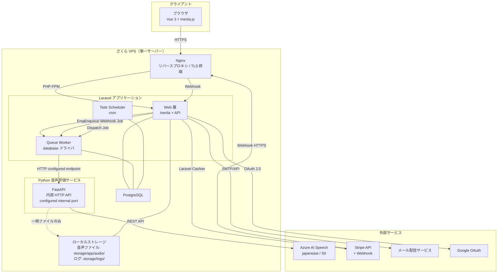
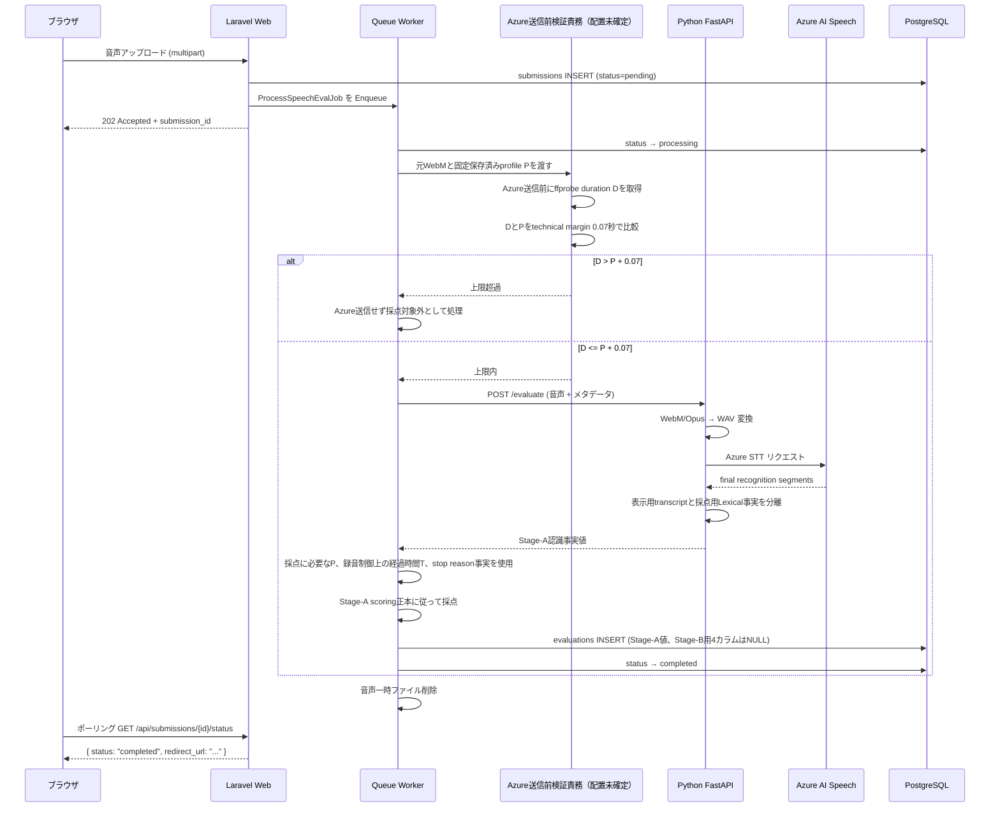

# ARCHITECTURE.md

> **Stage: Draft**
> **対象範囲: MVP（単一 VPS 運用）— フェーズ①「MVP の作成とテスト環境の検証」**
> **最終更新: 2026-05-14（MVP実装前レビュー反映）**

---

## 本文書の位置づけ

本文書は、日本語スピーチ練習アプリ MVP のシステムアーキテクチャを定義するハブ文書である。
実装フェーズの AI ディベロッパーが、この文書を起点に設計意図を把握し、各詳細文書へ到達できることを目標とする。

本文書で扱うのは**設計判断とその根拠**である。以下は別文書に分離して管理する。

| 関心事 | 正本 | 備考 |
|---|---|---|
| DB 設計（テーブル・カラム・制約・削除方針） | `DB_SCHEMA.md` | 18テーブル / 5カテゴリ |
| 未確定事項（業務判断待ち・PoC 待ち・運用詳細未定） | `OPEN_ISSUES.md` | 唯一の管理台帳 |
| 運用手順（点検・障害対応・リリース・バックアップ） | `OPERATIONS.md` | MVP テスト環境向け最小運用 |
| UI/UX 設計 | `DESIGN.md` | MVP UI/UX 設計の正本 |
| Stage-A 採点仕様 | `STAGE_A_SCORING.md` | 採点表・境界・version・再採点semanticsの正本 |
| プロジェクト全体像・フェーズ定義 | `README.md` | 入口文書 |

---

## 1. 概要

### 1.1 スコープ

- 単一 VPS（さくら VPS 3Core / 2GB / 200GB SSD）上での商用 MVP 運用
- Laravel + Python 音声評価サービスの疎結合構成
- Speech レイヤーと LLM レイヤーの分離

### 1.2 スコープ外

- マルチサーバー構成、コンテナオーケストレーション
- LLM 統合の詳細設計（将来拡張のインターフェースのみ §8 で定義）
- CI/CD パイプラインの詳細
- 性能・容量の詳細な評価枠組み（フェーズ②で具体化）

---

## 2. システム構成図



### 構成要素の選定理由

| 要素 | 選定 | MVP 制約との適合理由 | トレードオフ |
|---|---|---|---|
| Web サーバー | Nginx | TLS 終端 + リバースプロキシを1プロセスで担う。低メモリ消費 | 将来 L7 ルーティング複雑化時は設定の複雑化が課題 |
| アプリケーション | Laravel（PHP-FPM） | Inertia.js / Cashier / Queue 等 MVP 必要機能が組み込み | PHP-FPM ワーカー数が 2GB メモリ制約下でボトルネックになりうる |
| 音声評価 | FastAPI（Python） | Azure SDK Python 版が最も成熟。Laravel とは HTTP で疎結合 | プロセス常駐によるメモリ消費 |
| DB | PostgreSQL 16 | Laravel Cashier 互換、JSON カラム対応。UTF-8 | MySQL より初期メモリ消費がやや大きい |
| Queue | Laravel Queue（database ドライバ） | Redis 不要でメモリ節約。MVP 規模では十分 | 高頻度ポーリングで DB 負荷増。Redis 移行時は設定変更のみ |
| ファイル保管 | ローカルストレージ | MVP では S3 互換ストレージ不要 | VPS 障害時にデータ喪失リスク |

---

## 3. レイヤー構成

### 3.1 レイヤー定義

```text
┌───────────────────────────────────────────────────┐
│  プレゼンテーション層                                │
│  Vue 3 + Inertia.js（SSR なし）                     │
└──────────────────┬────────────────────────────────┘
                   │ Inertia Protocol (XHR)
┌──────────────────▼────────────────────────────────┐
│  アプリケーション層（Laravel）                        │
│  ┌─ Web Context ────────────────────────────────┐│
│  │ Controllers / FormRequests / Middleware       ││
│  │ Services（ビジネスロジック）                   ││
│  └──────────────────────────────────────────────┘│
│  ┌─ Queue Context ──────────────────────────────┐│
│  │ Jobs / Events / Listeners                    ││
│  └──────────────────────────────────────────────┘│
└──────┬───────────┬────────────────────────────────┘
       │           │ HTTP configured internal endpoint
       │    ┌──────▼──────────────────────┐
       │    │  音声評価層（Python / FastAPI）│
       │    │  Azure SDK 呼び出し          │
       │    └──────┬──────────────────────┘
       │           │ Azure REST API
       │    ┌──────▼──────────────────────┐
       │    │  外部 Speech 層（Azure）      │
       │    └─────────────────────────────┘
┌──────▼────────────────────────────────────────────┐
│  データ層: PostgreSQL + ローカルファイルストレージ     │
└───────────────────────────────────────────────────┘
┌───────────────────────────────────────────────────┐
│  外部サービス層: Stripe / Google OAuth / メール配信  │
│  ┌ ─ ─ ─ ─ ─ ─ ─ ─ ─ ─ ─ ─ ─ ─ ─ ─ ─ ─ ─ ─ ┐ │
│  │ LLM 層（将来拡張枠: Azure OpenAI 等）        │ │
│  │ インターフェースのみ §8 で定義                │ │
│  └ ─ ─ ─ ─ ─ ─ ─ ─ ─ ─ ─ ─ ─ ─ ─ ─ ─ ─ ─ ─ ┘ │
└───────────────────────────────────────────────────┘
```

### 3.2 レイヤー間の依存ルール

| レイヤー | 依存してよい方向 |
|---|---|
| プレゼンテーション | → アプリケーション層のみ（Inertia 経由） |
| アプリケーション（Laravel） | → データ層、音声評価層、外部サービス層 |
| 音声評価（Python） | → 外部 Speech 層のみ。Laravel DB に直接アクセスしない |
| データ / 外部サービス | 依存なし（受動） |

### 3.3 レイヤー間通信の設計制約

1. **Python → Laravel DB 直接アクセス禁止** — 評価結果は HTTP レスポンスで返し、Laravel 側で DB 保存
2. **Laravel → Python: HTTP 経由のみ** — 共有 DB・共有ファイルキューを介した暗黙的通信を禁止
3. **Python → Laravel: HTTP レスポンスのみ** — コールバック禁止
4. **Python サービスはステートレス** — 一時ファイル以外の永続化を持たない
5. **LLM 層の分離** — comment生成の既存インターフェースはSpeech／Stage-Aから分離し、現行Stage-A productionでは実行しない

---

## 4. Laravel ⇔ Python 通信方式

> **通信方式: HTTP 内部 API（localhost）を選定**
> 単一 VPS 内通信のため、HTTP localhost 呼び出しが最もシンプル。FastAPI で軽量 HTTP サーバーを常駐させ、Laravel Queue Worker から同期 HTTP リクエストで呼び出す。
> トレードオフ: 将来 VPS 分離時には、内部ネットワーク HTTP またはメッセージキュー方式への移行が必要。

**棄却: gRPC** — .proto 管理コストが MVP 規模に見合わない。  
**棄却: メッセージキュー** — Redis / RabbitMQ 追加は 2GB 制約下で不利。

### 4.1 エンドポイント

| メソッド | パス | 概要 | 認証 |
|---|---|---|---|
| POST | /evaluate | 音声ファイルを受け取り、Azure STTとStage-A採点に必要な認識事実値の取得を行う | X-Internal-Token |
| GET | /health | ヘルスチェック | なし（localhost 限定） |

### 4.2 リクエスト・レスポンス形式

**POST /evaluate リクエスト（multipart/form-data）:**

```text
audio_file:       (binary)       # WebM/Opus → Python 側で WAV 変換
submission_id:    "uuid-string"
question_id:      42
expected_duration: 60
```

**成功レスポンスの責務:**

- PythonはAzure STTを実行し、表示用transcriptとStage-A採点に必要な認識事実値を返す
- 表示用transcriptは各final recognition segmentの表示用textを半角空白で結合する
- `character_count`は表示用transcriptではなく、各segmentの`NBest[0].Lexical`をOI-029の`ja-jp-character-count-v1`で処理して算出する
- Pythonは算出した`character_count`と、適用したcharacter count versionの事実をLaravelへ返す。具体的なresponse field名は後続実装タスクで既存契約と整合させる
- Lexical取得不能時はDisplay、ITN、MaskedITN、表示用textへfallbackせず、Stage-A response contract failureとして扱う
- Pythonは`character_score`、`time_score`、`final_score`、`evaluation_result`を決定しない。Laravelが`STAGE_A_SCORING.md`に従って算出・保存する
- Stage-A productionではpronunciation、fluency、template comment、`overall_score`を生成しない

具体的なresponse field名、Lexical欠損時のHTTP status／error codeを含むcross-layer error contractは `OPEN_ISSUES.md` OI-112 と T000-10 で確定し、T007-06 / T008-05 / T009-06へ引き渡す。本節では未確定値を新規決定しない。

**エラーレスポンス:**

| コード | 意味 | Laravel 側の対処 |
|---|---|---|
| 422 | 音声認識不可（無音・ノイズ等） | status=failed、ユーザーに再提出案内 |
| 500 | Python 内部エラー | リトライ対象 |
| 502/503 | Azure API 障害 | リトライ対象 |

この表は現行実装の概要であり、`speech_unrecognized`、ffprobe / conversion failure、pre-Azure upper-limit、Azure unavailable、timeout、retry exhaustion、generic system failureの最終DB state・API field・UI actionは OI-112 の正本同期後に確定する。

### 4.3 タイムアウト設計

| パラメータ | 値 | 根拠 |
|---|---|---|
| 接続タイムアウト | 5秒 | localhost 接続は即時のため、5秒超は異常 |
| 読み取りタイムアウト | 120秒 | 最長音声（120秒）+ Azure 処理時間 |
| ジョブ全体タイムアウト | 180秒 | 読み取りタイムアウト + 前後処理マージン |

OI-030のtechnical margin `0.07秒`は元WebMのAzure送信前上限判定専用であり、接続・読み取り・ジョブ全体のtimeoutへ加算しない。

---

## 5. 非同期ジョブ設計

### 5.1 フロー概要



`D`は元WebMからffprobeで取得するduration、`P`はsubmissionへ固定保存した`evaluation_profile_seconds`である。`env-d`（iPhone Safari）で`format.duration`が`N/A`の場合にだけ、packetの`pts_time + duration_time`最大値をfallbackとして使用する。D取得・判定をLaravel／Pythonのどちらへ配置するか、ffprobe取得失敗時および上限超過時の最終API contractは本書で確定せず、後続実装で決定する。

OI-030の`0.07秒`をUI timer、ユーザー回答時間、auto stop時刻、time_score用の録音制御上の経過時間`T`、Queue timeout、HTTP timeoutへ転用しない。

time_score用`T`、stop reason／profile limit到達相当の事実はhistorical submissionの再採点を再現できる形で永続化する必要があるが、最終DBカラム名、型、精度、保存場所は本書で確定せず、T002-06 / T002-07へ委譲する。

### 5.2 リトライ方針

| パラメータ | 値 |
|---|---|
| 最大リトライ回数 | 3回 |
| バックオフ | 30秒 / 60秒 / 120秒 |
| リトライ対象 | 500, 502, 503, 接続タイムアウト |
| リトライ対象外 | 422（音声認識不可）, 401（認証エラー） |

全リトライ失敗時: `submissions.status` を `failed` に更新、`failed_jobs` テーブルへ記録。

### 5.3 べき等性保証（3層）

1. **ユニークジョブ制御** — `ShouldBeUnique`、キー=`submission_id`、ロック期間240秒
2. **ステータスチェック** — ジョブ開始時に `status !== 'pending'` なら正常終了
3. **DB ユニーク制約** — `evaluations.submission_id` UNIQUE

上記のリトライ方針とnon-pending no-opの関係は、current Stage-Aの最終retry contractとして未確定である。T008-05着手前に、authorized retry、duplicate dispatch、stale job、`processing`状態でのretry、terminal submission、retry exhaustionを区別するtask-local technical designを明確化し、T008-05で実装、T013-08でtestする。本文書では具体的なstatus transitionまたはretry実装方式を新規決定しない。

### 5.4 ステータス遷移

```text
[*] → pending → processing → completed
                           → failed
         pending → cancelled（MVP 未実装・将来枠）
```

### 5.5 ポーリング設計

> **HTTP ポーリングを選定。** Inertia.js と親和性が高く、WebSocket サーバー不要。

| 項目 | 値 |
|---|---|
| エンドポイント | GET /api/submissions/{id}/status |
| 間隔 | 3秒 |
| 最大回数 | 60回（= 3分） |
| 認証 | セッション認証。自分の submission_id のみ参照可 |

---

## 6. Feature Flag 設計

### 6.1 目的

PoC 未検証の機能（発音・流暢さ評価）の安全な有効/無効制御。デプロイと機能リリースの分離。

Pronunciation Assessment / Fluency Assessment は PoC 完了まで Feature Flag OFF を維持する。PoC成功だけでは有効化せず、将来Stage-Bとしての具体実装・表示仕様を別途確定した後に有効化を判断する。
continuous recognition の安定性検証は OI-010、PoC Go/No-Go は OI-012 で管理する。

現行Stage-A productionではFeature Flagの値にかかわらず、pronunciation、fluency、comment、`overall_score`をStage-A値として生成・保存・表示しない。これらは将来のStage-B用責務であり、具体的なStage-B実装方式は本書で新規確定しない。

### 6.2 MVP キー一覧

| キー | デフォルト | 説明 |
|---|---|---|
| `speech.pronunciation_assessment.enabled` | false | 将来のStage-B候補。現行Stage-Aでは使用せず、PoC成功だけでは有効化しない |
| `speech.fluency_assessment.enabled` | false | 将来のStage-B候補。現行Stage-Aでは使用せず、PoC成功だけでは有効化しない |
| `speech.content_assessment.enabled` | false | 内容評価（将来 LLM 統合用。MVP 常時 false） |
| `comment.llm_generation.enabled` | false | 将来のStage-B comment生成用。現行Stage-Aでは使用しない |

### 6.3 管理方式

> **config/features.php + .env を選定（MVP）**
> 追加テーブルや外部サービス不要。切替には `.env` 更新 + `config:cache` クリアが必要。
> 棄却: DB テーブル管理 — Flag 4件に対して管理画面 UI の実装コストが見合わない。

### 6.4 Python 側への伝達

`/evaluate` リクエストの `feature_flags` パラメータで、ジョブ実行時の Flag 状態を渡す。Python 側に独自の Flag 管理は持たせない。

### 6.5 将来の拡張パス

1. **DB テーブル方式** — ユーザー別/プラン別出し分けが必要になった時点
2. **SaaS（LaunchDarkly 等）** — A/B テスト・段階的ロールアウトが必要になった時点

Flag 参照は Service クラス経由に統一し、Controller / Vue から直接参照しない。

---

## 7. フロントエンド状態管理方針

### 7.1 基本方針

**Inertia props を第一選択**とし、ページ単位で完結するデータは props で受け取る。
Pinia store は「ページ遷移を跨ぐ状態」または「複数コンポーネントが同一状態を参照する場合」に限定。

### 7.2 Pinia Store（MVP）

| Store | 責務 |
|---|---|
| `useRecordingStore` | 録音状態（idle / recording / uploading）、録音時間、音声 Blob |
| `useSubmissionPollingStore` | ポーリング状態、submission_id |
| `useToastStore` | トースト通知キュー |

`useRecordingStore` → uploading 完了時に `submission_id` を `useSubmissionPollingStore` へ引き継ぎ、自身は idle にリセット。

### 7.3 Composables（MVP）

| Composable | 責務 |
|---|---|
| `useAudioRecorder` | MediaRecorder API ラッパー |
| `usePolling` | 汎用ポーリング |
| `useCountdown` | 録音カウントダウンタイマー |
| `useFeatureFlag` | Inertia shared data からの Feature Flag 参照 |

### 7.4 Feature Flag のフロントエンド伝達

`HandleInertiaRequests` ミドルウェアの shared data で全ページに自動配布。Vue 側は `useFeatureFlag` composable 経由で参照。

---

## 8. LLM レイヤー分離設計

> **将来のStage-B向け分離境界。**
> `CommentGeneratorInterface` / `TemplateCommentGenerator` は既存実装の履歴として存在するが、現行Stage-A productionの実行構成には含めない。既存Stage-A comment接続との差分はT010-04で補正する。Stage-Bの具体実装方式は後続で決定する。

### 8.1 既存テンプレート実装の配置

| 要素 | 配置 |
|---|---|
| `CommentGeneratorInterface` | `app/Contracts/` |
| `TemplateCommentGenerator` | `app/Services/Comment/` |
| `EvaluationResult` / `CommentResult` | `app/Dto/` |
| コメントテンプレート | `config/comment_templates.php` |

テンプレート選択実装は速度（slow / appropriate / fast）× 音声長（short / medium / long）を使用する既存資産である。速度補助分類自体は維持するが、Stage-Aの`final_score`へ反映せず、現行Stage-Aではtemplate commentを生成・保存・表示しない。

### 8.2 将来のStage-B

Stage-Bのcomment、内容・構成評価、Azure OpenAI等の具体構成は本タスクでは確定しない。Stage-Aと値を混在・上書きしない境界だけを維持する。

---

## 9. Azure AI Speech 連携設計

### 9.1 前提

| 項目 | 値 |
|---|---|
| リージョン | japaneast |
| SKU | Standard（S0） |
| MVP 確定利用 | Speech-to-Text（STT） |
| PoC 対象 | Pronunciation Assessment（日本語） |
| SDK | Azure Cognitive Services Speech SDK for Python |

### 9.2 音声形式変換

> **WAV 変換方式を選定。**
> ブラウザ録音（WebM/Opus）→ Python 側で WAV（PCM 16kHz 16bit mono）に変換後、Azure SDK に渡す。
> current approved implementationではsystem ffmpeg binaryをsubprocessから直接使用しており、pydub / moviepy / av等のwrapper packageは導入していない。これはcurrent implementation factであり、将来の変換実装方式を恒久的に禁止するものではない。変換後の一時 WAV は処理完了後に即時削除する。

### 9.3 Pronunciation Assessment（PoC 方針）

- 日本語での精度は未検証。PoC 完了まで Feature Flag OFF を維持
- PoC 実施タイミングと Go/No-Go 基準は `OPEN_ISSUES.md` OI-012 で管理
- continuous recognition の安定性は OI-010 で管理
- PoC 成功時のみ、Pronunciation Assessment / Fluency Assessment の正式有効化を判断する

---

## 10. セキュリティ方針

### 10.1 認証

- セッション認証（Laravel 標準）。Sanctum トークン認証は MVP 不使用
- メール + パスワード / Google OAuth（Socialite）
- メール認証あり / パスワード再設定あり
- Google OAuth のメール自動リンクは未確定（OI-016）

### 10.2 認可

- `users.role` で `user` / `admin` を区別。admin ミドルウェアで管理画面をガード
- ポリシーベース認可: 自分の submissions / evaluations のみ閲覧可
- MVP 管理画面の最小範囲は OI-028 で管理する
- 追加権限テーブルは現時点では追加しない
- 複数管理ロールや閲覧/編集/課金情報ごとの細分化権限は MVP の前提にしない

### 10.3 CSRF / CORS / レート制限

- CSRF: Laravel 標準（Inertia は CSRF トークン自動送信）
- CORS: 同一オリジンのため明示的 CORS 設定不要
- レート制限: Laravel 標準の `throttle` ミドルウェア。API 60回/分、ログイン試行 5回/分

### 10.4 内部通信セキュリティ

- Laravel ⇔ Python: `X-Internal-Token` ヘッダで認証。共有シークレットを `.env` で管理
- Python FastAPI は localhost のみ LISTEN。外部アクセス不可
- HTTPS は Nginx で TLS 終端。Let's Encrypt 利用

### 10.5 Stripe Webhook セキュリティ

- Stripe 署名検証（`Stripe-Signature` ヘッダ）で真正性を確認
- Webhook 処理は Queue 経由で非同期実行
- Webhook duplicate deliveryを安全に扱う。transport-level idempotenceはT014-06、business mutation idempotenceはT014-07の責務とする
- concrete idempotency key（Stripe event ID / business object Stripe ID等）とpersistence contractは未確定であり、T014-06 / T014-07着手前のtechnical clarificationで確定する
- MVP で処理対象とする Stripe Webhook イベントの最小範囲は OI-027 で管理する
- 契約状態同期は `DB_SCHEMA.md` の Stripe 関連テーブル定義と OI-027 を参照する
- 本文書では Webhook 対象イベントを確定済みとして列挙しない

---

## 11. 音声ファイル保管方針

> **ローカルストレージ（storage/app/audio/）で一時保管を選定。**
> 音声ファイルは永続保存しない。評価結果保存後、同一ジョブ内で即時削除を試行する。
> 削除失敗時は評価結果保存を優先し、後続の定期バッチで整合性を回復する。

- 保管パス: `storage/app/audio/{Y}/{m}/{submission_id}.webm`
- 削除タイミング: `evaluations` INSERT 成功後
- 退会時: soft delete 前に未削除音声を再走査し、フェイルセーフとして物理削除
- バックアップ対象外（非永続データ）

**棄却: S3 互換ストレージ** — MVP では不要。将来移行時は Laravel Filesystem の driver 変更のみ。

---

## 12. メール・ログ・SSL/TLS 方針

### 12.1 メール配信

> **Laravel 標準メール機能 + 外部 SMTP/API サービスを選定。**
> MVP での送信対象: メール認証、パスワードリセット、退会完了通知。
> 具体的なサービス選定は実装開始時に確定。

### 12.2 ログ方針

- Laravel 標準ログ（`storage/logs/`）を使用
- ローテーション: daily（Laravel 標準）
- レベル設計: production は `warning` 以上、staging は `debug`
- 音声評価ジョブ: `submission_id` を全ログ行に付与し追跡可能にする

### 12.3 SSL/TLS

- Nginx で TLS 終端。Let's Encrypt + certbot による自動更新
- HTTP → HTTPS リダイレクト必須
- 本番: `speech.manabuzo.jp` / 開発: `dev.manabuzo.jp`

---

## 13. DB エンティティ概要

DB 設計の正本は `DB_SCHEMA.md` である。本節はアーキテクチャ観点での橋渡しのみ示す。

### 13.1 テーブル構成（18テーブル / 5カテゴリ）

| カテゴリ | テーブル |
|---|---|
| User | `users`, `user_learning_settings`, `password_reset_tokens`, `sessions` |
| Learning | `categories`, `tags`, `questions`, `question_tag`, `submissions`, `evaluations` |
| Stripe | `customers`, `subscriptions`, `subscription_items`（Cashier v15+ 準拠） |
| System | `jobs`, `failed_jobs`, `cache`, `cache_locks` |
| Legal | `consents` |

### 13.2 主要な設計判断

- `questions.question_type` は **不採用**。復活させない
- `questions.question_format` は問題形式を表す分類軸として扱う
- `questions.question_format` の値域は解消済みOI-022および `DB_SCHEMA.md` の `single_prompt` / `two_choice` を正とする
- `questions.has_model_answer` は模範解答有無を表す
- `question_format` と `has_model_answer` は別概念であり、混同しない
- `submissions.id` は UUID v4（外部露出 ID の推測困難性を優先）
- `evaluations` は `submissions` と 1対1。`submission_id` UNIQUE
- `pronunciation_result` / `fluency_result` / `overall_score` / `comment` は将来のStage-B用nullableカラム。Stage-AのみではFeature FlagにかかわらずNULLとし、生成・表示しない
- Stage-Aは`final_score`を使用し、`overall_score`を代用にしない
- 音声ファイルは永続保存しない。`audio_path` は一時ファイルパス
- 退会: `users.deleted_at` による soft delete → 30日後 hard delete
- 退会時の実行中submission/Queueとの競合は OI-109、部分失敗・補償境界は OI-110、退会完了通知timingは OI-111で管理する
- ユーザー設定は OI-023 で確定済みの `question_format_preference` / `timer_display_mode` の2項目を `user_learning_settings` に保存する
- `users` JSONB方式は採用せず、`users` テーブルに設定JSONを追加しない
- `user_learning_settings`方式は採用済みで、historical T011-02で当時の5設定項目の保存基盤を実装した。current設定は`question_format_preference` / `timer_display_mode`の2項目とし、historical実装との差はT011-03で補正する。task詳細は`TASKS.md`を参照する

---

## 14. インフラ確定事項

### 14.1 VPS

| 項目 | 値 |
|---|---|
| プロバイダ | さくら VPS |
| スペック | 3Core / 2GB RAM / 200GB SSD |
| OS | Ubuntu（バージョンは実装時に確定） |

### 14.2 推奨バージョンセット

| 技術 | バージョン |
|---|---|
| PHP | 8.2+ |
| Laravel | 11.x |
| Python | 3.11+ |
| PostgreSQL | 16 |
| Node.js | 20 LTS |
| Nginx | mainline |

### 14.3 環境

| 環境 | ドメイン | ブランチ |
|---|---|---|
| 本番 | speech.manabuzo.jp | main |
| 開発 | dev.manabuzo.jp | develop |

### 14.4 バックアップ基本方針

- 対象: PostgreSQL 業務データ（音声ファイルは対象外）
- 日次1回、保持期間30日、暗号化前提
- 外部保管先は未確定（OI-020）
- DR: 単一リージョン前提。災害時は「別環境再構築 + バックアップ復元」

### 14.5 費用の主要変動要因

MVP における主要な変動費用は Azure AI Speech（STT: $1.00/音声時間）である。
基準ケース（100ユーザー × 1日3提出 × 平均60秒）で月間約 $150（推定）。
Pronunciation Assessment 追加時は約 $0.30/時間の追加（PoC 対象のため確定費用に含めない）。

---

## 15. 設計原則（確定前提の再掲）

本文書全体を通して維持する設計原則を再掲する。変更する場合は `OPEN_ISSUES.md` に記載のうえ承認を得る。

1. Speech レイヤーと LLM レイヤーを最初から分離する
2. Laravel 本体と Python 音声評価サービスは疎結合にする
3. MVP 時点では LLM を必須依存にしない
4. 将来 Azure OpenAI / Microsoft Foundry Models を追加可能にする
5. 日本語 Pronunciation Assessment は未検証 — 前提固定しない
6. 発音 / 流暢さは PoC 成功時のみ正式有効化する（Feature Flag で制御）
