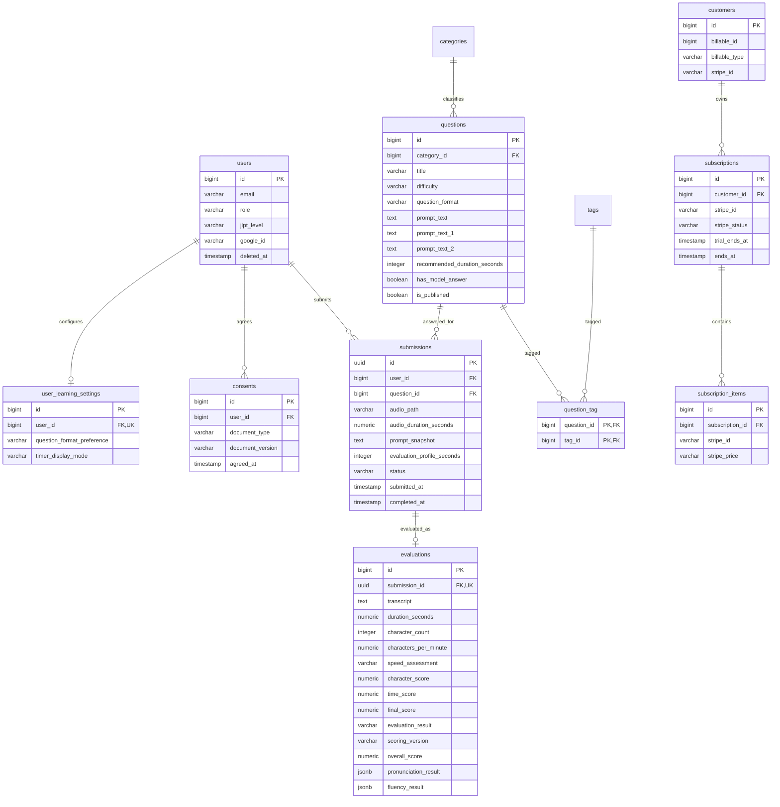

# DB_SCHEMA.md

> Stage: Draft  
> 対象範囲: MVP（18テーブル / 5カテゴリ）  
> DBMS: PostgreSQL 16 / UTF8

---

## 1. 概要

### 1.1 目的

本書は、日本語スピーチ練習アプリ MVP のデータベーススキーマを定義する設計文書である。  
実装者が Laravel マイグレーション、Eloquent モデル、バリデーション、Seeder、削除運用を迷わず実装できる粒度で記述する。

### 1.2 対象範囲

- MVP で使用する **18テーブル / 5カテゴリ**
- PostgreSQL 16 / UTF8 前提の型・制約・インデックス方針
- Laravel Cashier v15+ 準拠の Stripe 関連テーブル
- 音声提出・評価・法的同意・ジョブ・キャッシュを含む DB 設計
- `ARCHITECTURE.md §13` の詳細化
- MVP 実装前に必要なデータモデル・Seeder・削除方針の整理

### 1.3 前提

| 項目 | 内容 |
|---|---|
| DBMS | PostgreSQL 16 |
| エンコーディング | UTF8 |
| タイムゾーン | DB は UTC 保存、表示はアプリ層で JST 変換 |
| 認証 | セッション認証 |
| ENUM 方針 | PostgreSQL ENUM 型は使わず CHECK 制約方式 |
| MVP 不使用 | `job_batches`, `personal_access_tokens` |
| 実装対象外 | 実装コード、マイグレーションコード |

### 1.4 重要方針

- `users.jlpt_level` は nullable
- `questions.question_type` は **採用しない**
- `questions.question_format` は問題形式を表す分類軸として追加する
- `questions.question_format` の値域は `single_prompt` / `two_choice`
- `questions` は `has_model_answer` で模範解答有無を表す
- `question_format` と `has_model_answer` は別概念として扱う
- 問題は **1カテゴリ** に属し、**複数タグ** を持てる
- ユーザー設定2項目（出題方式・タイマー表示方式）は `user_learning_settings` テーブルへ保存し、`users` JSONB 方式は採用しない
- 評価プロファイルの値域は `10 / 40 / 60 / 90 / 120` 秒とし、問題ごとの初期値を `questions.recommended_duration_seconds` へ明示保存する
- 提出時に実際に使用した設問文と最終選択評価プロファイルを `submissions` へ保存し、Queue・採点・結果表示はその保存値を使用する
- `submissions` : `evaluations` = **1 : 0..1** とし、`evaluations.submission_id` は UNIQUE
- `submissions.audio_path` は **一時ファイルパス**。`completed` / `failed` 時に物理削除し、音声は永続保存しない
- 退会は `users.deleted_at` による soft delete、保持期間は **30日**
- Stripe は Laravel Cashier v15+ 準拠、単一プラン **Standard / 月額660円（税込）/ 7日間トライアル / クレジットカードのみ / 解約は期間終了時**
- `consents` は **新規登録時のみ** 取得し、規約更新時の再同意は MVP 対象外

---

## 2. 全テーブル一覧（18テーブル / 5カテゴリ早見表）

| カテゴリ | テーブル名 | 役割 |
|---|---|---|
| User | `users` | ユーザー、ロール、JLPT、soft delete |
| User | `user_learning_settings` | ユーザーごとの練習条件設定 |
| User | `password_reset_tokens` | パスワード再設定トークン |
| User | `sessions` | セッション管理 |
| Learning | `categories` | 問題カテゴリ |
| Learning | `tags` | 問題タグ |
| Learning | `questions` | 問題マスタ |
| Learning | `question_tag` | 問題-タグ中間 |
| Learning | `submissions` | 音声提出 |
| Learning | `evaluations` | 評価結果 |
| Stripe | `customers` | Stripe 顧客情報 |
| Stripe | `subscriptions` | Stripe 契約 |
| Stripe | `subscription_items` | Stripe 契約明細 |
| System | `jobs` | Queue ジョブ |
| System | `failed_jobs` | 失敗ジョブ |
| System | `cache` | キャッシュ |
| System | `cache_locks` | キャッシュロック |
| Legal | `consents` | 利用規約・プライバシーポリシー同意記録 |

### 2.1 MVP 不使用テーブル

- `job_batches`
- `personal_access_tokens`

### 2.2 ユーザー設定保存先

設定画面の2項目は、OI-023確定方針に従い `user_learning_settings` テーブルへ保存する。

対象:

- 出題方式
- タイマー表示方式

保存方式:

- `user_learning_settings` テーブルを使用する
- `users` JSONB 方式は採用しない
- `users` テーブルに設定JSONを追加しない
- `users` : `user_learning_settings` = 1 : 0..1
- 1ユーザーにつき `user_learning_settings` は0件または1件とする
- `user_learning_settings.user_id` の UNIQUE 制約により、同一ユーザーに複数の設定レコードを作成できない
- 設定レコード作成後はユーザーと設定レコードを論理上一対一として扱うが、全ユーザーへの設定レコード必須生成および既存ユーザーへのバックフィル方法は本書では確定しない
- `question_format_preference` は出題開始時の初期選択・絞り込み条件にのみ使用し、問題形式、submission、採点条件を上書きしない
- `timer_display_mode` は数値タイマーの表示方式のみを制御する
- どちらのタイマー表示方式でも、評価プロファイル別上限監視を常時有効とする
- 文字起こしは常時表示する

---

## 3. エンティティ関連図

> ※ ER 図は **主要カラムのみ表示** する。完全定義は **§4** を参照。



### 3.1 主要リレーション

- `users` : `submissions` = 1:N
- `users` : `user_learning_settings` = 1:0..1
- `submissions` : `evaluations` = 1:0..1
- `categories` : `questions` = 1:N
- `questions` : `tags` = N:N（`question_tag` 経由）
- `users` : `consents` = 1:N
- `customers` : `subscriptions` = 1:N
- `subscriptions` : `subscription_items` = 1:N

---

## 4. テーブル詳細定義

### 4-1. User

#### 4-1-1. `users`

**目的 / 役割**  
ユーザーの認証、プロフィール、権限、JLPT レベル、退会状態を管理する。

**カラム定義表**

| カラム名 | 型 | NULL可否 | デフォルト | 説明 |
|---|---|---:|---|---|
| `id` | bigint | No | IDENTITY | ユーザー ID |
| `name` | varchar(255) | No | なし | 表示名 |
| `email` | varchar(255) | No | なし | ログイン用メールアドレス |
| `email_verified_at` | timestamp | Yes | NULL | メール認証日時 |
| `password` | varchar(255) | Yes | NULL | パスワードハッシュ。Google ログイン専用は NULL |
| `role` | varchar(20) | No | `'user'` | `admin` / `user` |
| `jlpt_level` | varchar(20) | Yes | NULL | `N1/N2/N3/N4/N5/unknown/not_specified` |
| `google_id` | varchar(255) | Yes | NULL | Google OAuth ID |
| `avatar_url` | varchar(2048) | Yes | NULL | プロフィール画像 URL |
| `remember_token` | varchar(100) | Yes | NULL | Laravel 標準 |
| `deleted_at` | timestamp | Yes | NULL | soft delete 日時。30日保持の起点 |
| `created_at` | timestamp | No | CURRENT_TIMESTAMP | 作成日時 |
| `updated_at` | timestamp | No | CURRENT_TIMESTAMP | 更新日時 |

**主キー**  
- `id`

**外部キー（参照先 / ON DELETE / ON UPDATE）**  
- なし

**ユニーク制約**  
- 部分 UNIQUE: `email` WHERE `deleted_at IS NULL`
- 部分 UNIQUE: `google_id` WHERE `deleted_at IS NULL AND google_id IS NOT NULL`

**代表的なインデックス**  
- 部分 UNIQUE: `email`
- 部分 UNIQUE: `google_id`
- `role`
- `deleted_at`

**代表的なクエリ例**

```sql
SELECT id, name, email, role
FROM users
WHERE email = $1
  AND deleted_at IS NULL;
```

**備考**  
- 個人情報: `name`, `email`, `google_id`, `avatar_url`
- 監査対象: `role`, `deleted_at`
- soft delete 後の同一メール再登録を許容するため、通常 UNIQUE ではなく部分 UNIQUE を採用する
- ユーザー設定2項目は `users` に保持しない。OI-023確定方針により、`user_learning_settings` テーブルへ分離する

---

#### 4-1-2. `user_learning_settings`

**目的 / 役割**  
ユーザーごとの出題方式とタイマー表示方式を管理する。設定は出題開始時の初期状態と録音中の表示だけに使用し、問題形式、submission、採点条件を上書きしない。

**カラム定義表**

| カラム名 | 型 | NULL可否 | デフォルト | 説明 |
|---|---|---:|---|---|
| `id` | bigint | No | IDENTITY | ユーザー設定 ID |
| `user_id` | bigint | No | なし | `users.id` への参照。1ユーザーにつき設定レコードは最大1件 |
| `question_format_preference` | varchar(50) | No | `'single_prompt'` | 出題方式。`single_prompt` / `two_choice` |
| `timer_display_mode` | varchar(50) | No | `'count_down'` | タイマー表示方式。`count_down` / `hidden` |
| `created_at` | timestamp | No | CURRENT_TIMESTAMP | 作成日時 |
| `updated_at` | timestamp | No | CURRENT_TIMESTAMP | 更新日時 |

**主キー**  
- `id`

**外部キー（参照先 / ON DELETE / ON UPDATE）**  
- `user_id` → `users.id` / CASCADE / CASCADE

**ユニーク制約**  
- UNIQUE: `user_id`

**CHECK 制約**
- `question_format_preference IN ('single_prompt', 'two_choice')`
- `timer_display_mode IN ('count_down', 'hidden')`

**代表的なインデックス**  
- UNIQUE: `user_id`

**代表的なクエリ例**

```sql
SELECT user_id,
       question_format_preference,
       timer_display_mode
FROM user_learning_settings
WHERE user_id = $1;
```

**備考**  
- OI-023確定方針により、`users` JSONB方式は採用しない
- 1ユーザーにつき設定レコードは0件または1件とする
- ユーザー削除時は `user_learning_settings` も CASCADE で削除する
- `question_format_preference` は出題開始時の初期選択・絞り込み条件であり、`questions.question_format`、submission、採点条件を上書きしない
- `count_down` は評価プロファイルの残り時間を0まで表示し、その後は残り時間表示を終了して経過時間表示へ切り替える
- `hidden` は録音中の数値タイマーを表示しない
- タイマー表示方式にかかわらず、評価プロファイル別上限監視を常時有効とする
- 文字起こしは常時表示する

---

#### 4-1-3. `password_reset_tokens`

**目的 / 役割**  
パスワード再設定用トークンを保持する Laravel 標準テーブル。

**カラム定義表**

| カラム名 | 型 | NULL可否 | デフォルト | 説明 |
|---|---|---:|---|---|
| `email` | varchar(255) | No | なし | 対象メールアドレス |
| `token` | varchar(255) | No | なし | リセットトークン |
| `created_at` | timestamp | Yes | NULL | 作成日時 |

**主キー**  
- `email`

**外部キー（参照先 / ON DELETE / ON UPDATE）**  
- なし

**ユニーク制約**  
- 主キーに含む

**代表的なインデックス**  
- 主キーのみ

**代表的なクエリ例**

```sql
SELECT email, token, created_at
FROM password_reset_tokens
WHERE email = $1;
```

**備考**  
- Laravel 標準
- 機密情報: `token`

---

#### 4-1-3. `sessions`

**目的 / 役割**  
セッション認証のサーバー側状態を保持する。

**カラム定義表**

| カラム名 | 型 | NULL可否 | デフォルト | 説明 |
|---|---|---:|---|---|
| `id` | varchar(255) | No | なし | セッション ID |
| `user_id` | bigint | Yes | NULL | ログイン中ユーザー ID |
| `ip_address` | varchar(45) | Yes | NULL | IP アドレス |
| `user_agent` | text | Yes | NULL | ブラウザ情報 |
| `payload` | text | No | なし | シリアライズ済みデータ |
| `last_activity` | integer | No | なし | 最終アクセス UNIX 時刻 |

**主キー**  
- `id`

**外部キー（参照先 / ON DELETE / ON UPDATE）**  
- なし（Laravel 標準に合わせ FK なし）

**ユニーク制約**  
- 主キーに含む

**代表的なインデックス**  
- `user_id`
- `last_activity`

**代表的なクエリ例**

```sql
DELETE FROM sessions
WHERE user_id = $1;
```

**備考**  
- 個人情報: `ip_address`, `user_agent`
- 退会時は `deleted_at` 設定前に全セッションを削除する

---

### 4-2. Learning

#### 4-2-1. `categories`

**目的 / 役割**  
問題の大分類を管理するカテゴリマスタ。

**カラム定義表**

| カラム名 | 型 | NULL可否 | デフォルト | 説明 |
|---|---|---:|---|---|
| `id` | bigint | No | IDENTITY | カテゴリ ID |
| `name` | varchar(100) | No | なし | 表示名 |
| `slug` | varchar(100) | No | なし | 一意識別子 |
| `description` | text | Yes | NULL | 管理用説明 |
| `display_order` | integer | No | `0` | 表示順 |
| `is_active` | boolean | No | `true` | 有効フラグ |
| `created_at` | timestamp | No | CURRENT_TIMESTAMP | 作成日時 |
| `updated_at` | timestamp | No | CURRENT_TIMESTAMP | 更新日時 |

**主キー**  
- `id`

**外部キー（参照先 / ON DELETE / ON UPDATE）**  
- なし

**ユニーク制約**  
- `name`
- `slug`

**代表的なインデックス**  
- `display_order`
- `is_active`

**代表的なクエリ例**

```sql
SELECT id, name, slug
FROM categories
WHERE is_active = true
ORDER BY display_order ASC, id ASC;
```

**備考**  
- seed 対象
- 問題は必ず 1 カテゴリに属するため、参照中カテゴリの削除は許可しない

---

#### 4-2-2. `tags`

**目的 / 役割**  
問題に横断的な属性を付与するタグマスタ。

**カラム定義表**

| カラム名 | 型 | NULL可否 | デフォルト | 説明 |
|---|---|---:|---|---|
| `id` | bigint | No | IDENTITY | タグ ID |
| `name` | varchar(100) | No | なし | 表示名 |
| `slug` | varchar(100) | No | なし | 一意識別子 |
| `created_at` | timestamp | No | CURRENT_TIMESTAMP | 作成日時 |
| `updated_at` | timestamp | No | CURRENT_TIMESTAMP | 更新日時 |

**主キー**  
- `id`

**外部キー（参照先 / ON DELETE / ON UPDATE）**  
- なし

**ユニーク制約**  
- `name`
- `slug`

**代表的なインデックス**  
- `slug`

**代表的なクエリ例**

```sql
SELECT id, name, slug
FROM tags
ORDER BY name ASC;
```

**備考**  
- seed 対象
- 例: `N3`, `敬語`, `面接`

---

#### 4-2-3. `questions`

**目的 / 役割**  
スピーチ練習で出題する問題本体を管理する。

**カラム定義表**

| カラム名 | 型 | NULL可否 | デフォルト | 説明 |
|---|---|---:|---|---|
| `id` | bigint | No | IDENTITY | 問題 ID |
| `category_id` | bigint | No | なし | 所属カテゴリ ID |
| `title` | varchar(255) | No | なし | 問題タイトル |
| `difficulty` | varchar(20) | No | なし | 難易度 |
| `question_format` | varchar(50) | No | なし | 問題形式。`difficulty` とは独立した分類軸。値域は `single_prompt` / `two_choice` |
| `prompt_text` | text | Yes | NULL | 単一設問の出題文。`single_prompt` で使用 |
| `prompt_text_1` | text | Yes | NULL | 二テーマ選択の1件目の設問文。`two_choice` で使用 |
| `prompt_text_2` | text | Yes | NULL | 二テーマ選択の2件目の設問文。`two_choice` で使用 |
| `recommended_duration_seconds` | integer | No | `60` | 問題ごとの初期評価プロファイル |
| `has_model_answer` | boolean | No | `false` | 模範解答の有無 |
| `model_answer_text` | text | Yes | NULL | 模範解答本文 |
| `is_published` | boolean | No | `false` | 公開状態 |
| `display_order` | integer | No | `0` | カテゴリ内表示順 |
| `created_at` | timestamp | No | CURRENT_TIMESTAMP | 作成日時 |
| `updated_at` | timestamp | No | CURRENT_TIMESTAMP | 更新日時 |

**主キー**  
- `id`

**外部キー（参照先 / ON DELETE / ON UPDATE）**  
- `category_id` → `categories.id` / RESTRICT / CASCADE

**ユニーク制約**  
- なし

**CHECK 制約**
- `question_format IN ('single_prompt', 'two_choice')`
- `recommended_duration_seconds IN (10, 40, 60, 90, 120)`
- 問題形式と設問文カラムの整合性:

```sql
CHECK (
    (
        question_format = 'single_prompt'
        AND prompt_text IS NOT NULL
        AND btrim(prompt_text) <> ''
        AND prompt_text_1 IS NULL
        AND prompt_text_2 IS NULL
    )
    OR
    (
        question_format = 'two_choice'
        AND prompt_text IS NULL
        AND prompt_text_1 IS NOT NULL
        AND btrim(prompt_text_1) <> ''
        AND prompt_text_2 IS NOT NULL
        AND btrim(prompt_text_2) <> ''
    )
)
```

- `prompt_text_1` と `prompt_text_2` が異なる文章であることは DB 制約に含めない

**代表的なインデックス**  
- `category_id`
- `difficulty`
- `question_format`
- 複合: (`category_id`, `is_published`, `display_order`)
- 複合: (`difficulty`, `question_format`, `is_published`)

**代表的なクエリ例**

```sql
SELECT id,
       title,
       difficulty,
       question_format,
       prompt_text,
       prompt_text_1,
       prompt_text_2,
       recommended_duration_seconds,
       has_model_answer
FROM questions
WHERE category_id = $1
  AND difficulty = $2
  AND question_format = $3
  AND is_published = true
ORDER BY display_order ASC, id ASC;
```

**備考**  
- `question_type` は復活させない
- `question_format` は「問題形式」を表す
- `has_model_answer` は「模範解答有無」を表す
- `question_format` と `has_model_answer` は別概念である
- `question_format` の値域は `single_prompt` / `two_choice`
- `single_prompt` は正本文書上「単一設問」、ユーザー向け表示「単体問題」とし、1つの設問について1件のスピーチを提出する
- `two_choice` は正本文書上「二テーマ選択」、ユーザー向け表示「2択」とし、2つのテーマから話したい方を1つ選び、選択したテーマについて1件のスピーチを提出する
- `two_choice` は正解・不正解、正解番号、テーマごとの得点、テーマ別評価結果を持たず、常に1提出・1評価とする
- 二テーマ選択専用テーブル、テーマ専用ID、`question_topics`、`selected_topic_id` は追加しない
- `question_format` は PostgreSQL ENUM 型ではなく varchar + CHECK 制約方式で扱う
- `single_prompt` は `prompt_text` のみを使用し、`two_choice` は `prompt_text_1` / `prompt_text_2` のみを使用する
- `recommended_duration_seconds` は問題ごとの初期評価プロファイルである
- 10秒スピーチチャレンジには `10`、それ以外の問題には原則 `60` を問題データへ明示保存する
- タグ文字列から評価プロファイルを動的判定しない
- 問題を開いた時点の初期選択値として使用し、ユーザーは録音開始前に変更できる
- 提出後の録音上限、採点、結果表示には現在の問題設定を再利用せず、`submissions.evaluation_profile_seconds` を使用する
- 音声評価サービスへ渡す実行時パラメータ `expected_duration` は `submissions.evaluation_profile_seconds` から取得する
- OI-030で確定したproduction共通technical marginは `0.07秒` であり、`recommended_duration_seconds`、`evaluation_profile_seconds`、`expected_duration` に加算しない。Azure送信前判定の詳細は `docs/verification/t000-06/OI-030_DECISION.md` を参照する
- 問題分類は `category_id`、`question_format`、`question_tag` で表現する
- 公開範囲は会員登録済みユーザーのみ

---

#### 4-2-4. `question_tag`

**目的 / 役割**  
`questions` と `tags` の多対多関係を管理する中間テーブル。

**カラム定義表**

| カラム名 | 型 | NULL可否 | デフォルト | 説明 |
|---|---|---:|---|---|
| `question_id` | bigint | No | なし | 問題 ID |
| `tag_id` | bigint | No | なし | タグ ID |

**主キー**  
- 複合主キー: (`question_id`, `tag_id`)

**外部キー（参照先 / ON DELETE / ON UPDATE）**  
- `question_id` → `questions.id` / CASCADE / CASCADE
- `tag_id` → `tags.id` / CASCADE / CASCADE

**ユニーク制約**  
- 複合主キーに含む

**代表的なインデックス**  
- `tag_id`

**代表的なクエリ例**

```sql
SELECT t.id, t.name
FROM question_tag qt
JOIN tags t ON t.id = qt.tag_id
WHERE qt.question_id = $1
ORDER BY t.name ASC;
```

**備考**  
- `question_id`, `tag_id` の重複紐付けを禁止する

---

#### 4-2-5. `submissions`

**目的 / 役割**  
ユーザーの音声提出を管理する。提出・処理中・完了・失敗の状態遷移を保持する。

**カラム定義表**

| カラム名 | 型 | NULL可否 | デフォルト | 説明 |
|---|---|---:|---|---|
| `id` | uuid | No | `gen_random_uuid()` | 提出 ID |
| `user_id` | bigint | No | なし | 提出ユーザー ID |
| `question_id` | bigint | No | なし | 対象問題 ID |
| `audio_path` | varchar(500) | No | なし | 一時ファイルパス。`completed` / `failed` 時に物理削除し、音声データは永続保存しない |
| `audio_size_bytes` | integer | Yes | NULL | 音声サイズ |
| `audio_duration_seconds` | numeric(8,2) | Yes | NULL | 録音ファイルから取得した実測秒数 |
| `prompt_snapshot` | text | No | なし | 提出時に実際に使用した設問文1件のスナップショット |
| `evaluation_profile_seconds` | integer | No | なし | 録音開始前に最終選択されていた評価プロファイル |
| `status` | varchar(20) | No | `'pending'` | 提出状態 |
| `error_message` | text | Yes | NULL | 失敗時エラー |
| `submitted_at` | timestamp | No | CURRENT_TIMESTAMP | 提出日時 |
| `completed_at` | timestamp | Yes | NULL | 完了または失敗確定日時 |
| `created_at` | timestamp | No | CURRENT_TIMESTAMP | 作成日時 |
| `updated_at` | timestamp | No | CURRENT_TIMESTAMP | 更新日時 |

**主キー**  
- `id`

**外部キー（参照先 / ON DELETE / ON UPDATE）**  
- `user_id` → `users.id` / CASCADE / CASCADE
- `question_id` → `questions.id` / RESTRICT / CASCADE

**ユニーク制約**  
- なし

**CHECK 制約**
- `btrim(prompt_snapshot) <> ''`
- `evaluation_profile_seconds IN (10, 40, 60, 90, 120)`

**代表的なインデックス**  
- `user_id`
- `question_id`
- `status`
- 複合: (`user_id`, `status`)

**代表的なクエリ例**

```sql
SELECT id,
       prompt_snapshot,
       evaluation_profile_seconds,
       status,
       submitted_at,
       completed_at
FROM submissions
WHERE id = $1
  AND user_id = $2;
```

**備考**  
- `audio_path` は一時ファイルパスであり、永続ファイル参照ではない
- `audio_duration_seconds` は実測値であり、`questions.recommended_duration_seconds` とは別概念である
- `prompt_snapshot` は実際に使用した設問文1件だけを保存する。`single_prompt` では `questions.prompt_text`、`two_choice` ではユーザーが選択した `questions.prompt_text_1` または `questions.prompt_text_2` を保存する
- `prompt_snapshot` により、提出後に問題が編集されても提出時の設問文を再現できる
- `evaluation_profile_seconds` は提出処理で必ず明示保存し、録音上限、採点、結果表示の基準とする
- Queue処理時に現在のquestionやuser settingから評価プロファイルを再取得しない
- `expected_duration` はDBカラムではなく、`submissions.evaluation_profile_seconds` を Laravel から Python へ渡す実行時パラメータとする
- OI-030で確定したproduction共通technical marginは `0.07秒` であり、`evaluation_profile_seconds` または `expected_duration` へ加算しない
- 元WebMのffprobe durationを`D`、固定保存済み`evaluation_profile_seconds`を`P`とし、Azure送信前に `D <= P + 0.07` を上限内、`D > P + 0.07` を上限超過として扱う。上限超過時はAzureへ送信せず、Stage-A採点およびevaluation作成を行わない
- 既存データの `prompt_snapshot` / `evaluation_profile_seconds` バックフィル方法は本書では確定しない
- `completed` / `failed` 確定時に音声ファイル実体を物理削除する
- 即時削除に失敗した場合の回復手段は CleanupTempFilesJob とする
- CleanupTempFilesJob の実行頻度および削除対象条件は OI-021 で管理する
- 退会処理時は soft delete 実行前に未削除音声を再走査し、フェイルセーフとして物理削除する
- 音声実体は個人情報性が高いため永続保存しない
- 音声一時ファイルはバックアップ対象外とする

---

#### 4-2-6. `evaluations`

**目的 / 役割**  
Azure AI Speech の認識が成功し、Stage-A評価結果が成立した提出の定量評価を保持する。`submissions` : `evaluations` = 1 : 0..1 とし、1提出に複数評価は作成しない。

評価レコードを作成するケース:

- 認識成功・合格
- 認識成功・採点不合格

評価レコードを作成しないケース:

- STT認識不可（422）
- Azure送信前の時間上限超過
- システム障害

認識成功後の採点不合格は `final_score = 0`、`evaluation_result = 'fail'` として評価レコードを作成する。

**カラム定義表**

| カラム名 | 型 | NULL可否 | デフォルト | 説明 |
|---|---|---:|---|---|
| `id` | bigint | No | IDENTITY | 評価 ID |
| `submission_id` | uuid | No | なし | 提出 ID。1提出1評価 |
| `transcript` | text | No | なし | Stage-Aで認識された書き起こし全文。想定上限 10,000 文字 |
| `duration_seconds` | numeric(8,2) | No | なし | Azure AI Speech が認識した各発話セグメントの認識時間合計 |
| `character_count` | integer | No | なし | Azure認識結果から採点規則に従って算出した文字数 |
| `characters_per_minute` | numeric(8,2) | No | なし | `character_count / duration_seconds × 60` の算出値 |
| `speed_assessment` | varchar(20) | No | なし | `slow` / `appropriate` / `fast` |
| `character_score` | numeric(5,2) | No | なし | 文字数帯による基本スコア |
| `time_score` | numeric(5,2) | No | なし | 録音制御上の経過時間`T`とstop reasonに基づくStage-A component score |
| `final_score` | numeric(5,2) | No | なし | Stage-Aで表示するスコア |
| `evaluation_result` | varchar(20) | No | なし | `pass` / `fail` |
| `scoring_version` | varchar(50) | No | なし | 適用した採点方式の識別子 |
| `pronunciation_result` | jsonb | Yes | NULL | 将来のStage-B追加評価。Stage-Aのみでは NULL |
| `fluency_result` | jsonb | Yes | NULL | 将来のStage-B追加評価。Stage-Aのみでは NULL |
| `overall_score` | numeric(5,2) | Yes | NULL | 将来のStage-B総合スコア。Stage-Aのみでは NULL |
| `comment` | text | Yes | NULL | 将来のStage-B追加コメント。Stage-Aのみでは NULL |
| `azure_request_id` | varchar(255) | Yes | NULL | Stage-AのAzure AI Speechリクエスト追跡 ID |
| `raw_azure_response` | jsonb | Yes | NULL | Stage-AのAzure AI Speech応答保存領域。想定上限 500KB/件 |
| `processing_time_ms` | integer | Yes | NULL | 処理時間ミリ秒 |
| `created_at` | timestamp | No | CURRENT_TIMESTAMP | 作成日時 |
| `updated_at` | timestamp | No | CURRENT_TIMESTAMP | 更新日時 |

**主キー**  
- `id`

**外部キー（参照先 / ON DELETE / ON UPDATE）**  
- `submission_id` → `submissions.id` / CASCADE / CASCADE

**ユニーク制約**  
- `submission_id` UNIQUE

**CHECK 制約**
- `btrim(transcript) <> ''`
- `duration_seconds > 0`
- `character_count >= 0`
- `characters_per_minute >= 0`
- `speed_assessment IN ('slow', 'appropriate', 'fast')`
- `character_score BETWEEN 0 AND 100`
- `time_score BETWEEN 0 AND 100`
- `final_score BETWEEN 0 AND 100`
- `evaluation_result IN ('pass', 'fail')`
- `btrim(scoring_version) <> ''`
- `evaluation_result` と `final_score` の組み合わせは DB CHECK へ固定せず、採点処理とテストで保証する

**代表的なインデックス**  
- UNIQUE: `submission_id`
- `speed_assessment`
- `created_at`

**代表的なクエリ例**

```sql
SELECT *
FROM evaluations
WHERE submission_id = $1;
```

**備考**  
- Stage-Aは Azure AI Speech による音声認識・定量評価であり、Stage-Bは Azure OpenAI 等による内容・構成等の追加評価である
- Stage-BはStage-Aを置き換えず、Stage-Aへ追加する拡張段階とする。Stage-B導入後も `final_score` と関連するStage-A評価を表示する
- `duration_seconds` はAzure AI Speechが認識した各発話セグメントの認識時間合計であり、音声ファイル側のduration系事実である `submissions.audio_duration_seconds`、選択評価プロファイルである `submissions.evaluation_profile_seconds`、time_scoreに使用する録音制御上の経過時間`T`とは別概念である。`duration_seconds`をtime_score入力に使用しない
- `character_count` はAzureを再実行せずに再採点するための事実値として保存する
- OI-029の文字数算出規則は確定済みである。表示用transcriptと採点用`NBest[0].Lexical`を分離し、`ja-jp-character-count-v1`に従って`character_count`を算出する。詳細は `docs/verification/t000-05/OI-029_DECISION.md` を参照する
- `characters_per_minute` は `character_count / duration_seconds × 60` で算出し、小数第2位まで保存する。分母にはAzure認識区間の合計時間を使い、無音・未認識区間を含めない
- `speed_assessment` は保存した小数の `characters_per_minute` を基準に判定する。UI表示時の丸めは本書で確定しない
- OI-015 は MVP 初期値として解消済みであり、初期閾値は `slow`: `characters_per_minute < 180`、`appropriate`: `180 <= characters_per_minute <= 320`、`fast`: `characters_per_minute > 320`
- 速度区分は参考分類であり、`final_score` または `evaluation_result` へ直接反映しない
- 速度判定閾値は DB CHECK へ固定せず、アプリケーション側のversion管理された評価設定で管理する。具体的な設定ファイル名は固定しない
- 実Azure / 実音声評価データ確認後に調整可能とする
- Stage-A採点は `docs/STAGE_A_SCORING.md` を正本とする。初期versionは `stage-a-scoring-v1` であり、`final_score = min(character_score, time_score)`、pass thresholdは60とする。profile別採点表、境界、stop reason、再採点semanticsは正本を参照する
- `pronunciation_result` / `fluency_result` / `overall_score` / `comment` は将来のStage-B用nullableカラムとして維持し、Stage-Aのみでは生成・表示せず NULL とする
- Stage-B導入後はStage-A結果に追加して使用・表示し、`final_score` を `overall_score` へ転用しない
- `azure_request_id` / `raw_azure_response` はStage-AのAzure AI Speech情報に限定し、将来のAzure OpenAI等のStage-B情報を混在・上書きしない
- 今回はStage-B用カラムまたはStage-B専用テーブルを追加しない
- Stage-Aのfailure時にevaluationを作成するか、submissionをどのterminal stateへ遷移させるか、status API/UIへどのerrorを返すかというcross-layer contractは OI-112 / T000-10で確定する。本書では未確定のfield/statusを追加しない
- `raw_azure_response` は全文検索しない
- `raw_azure_response` に GIN インデックスは付与しない
- 非機能要件: `raw_azure_response` は 1件 500KB を想定上限とする
- 500KB 超過時の保持方針は OI-107 で管理する
- 非機能要件: `transcript` は 10,000 文字を想定上限とする
- Stage-A必須カラムの既存データ移行方法は本書では確定しない
- 再採点に必要な`character_count_version`、time_score用`T`、stop reason／profile limit到達相当の事実は永続化が必要である。ただし最終カラム名、型、精度、保存場所、migration内容は本書では確定せず、T002-06 / T002-07で決定する

---

### 4-3. Stripe

> Laravel Cashier v15+ 準拠。支払方法はクレジットカードのみ。  
> 単一プランは `Standard`、月額 660 円（税込）、7日間トライアル、解約は期間終了時。

#### 4-3-1. `customers`

**目的 / 役割**  
アプリ上のユーザーと Stripe 顧客を紐づける。

**カラム定義表**

| カラム名 | 型 | NULL可否 | デフォルト | 説明 |
|---|---|---:|---|---|
| `id` | bigint | No | IDENTITY | 顧客レコード ID |
| `billable_id` | bigint | No | なし | ユーザー ID 相当 |
| `billable_type` | varchar(255) | No | なし | モデル種別 |
| `stripe_id` | varchar(255) | No | なし | Stripe 顧客 ID |
| `pm_type` | varchar(255) | Yes | NULL | 支払方法種別 |
| `pm_last_four` | varchar(4) | Yes | NULL | カード下4桁 |
| `trial_ends_at` | timestamp | Yes | NULL | トライアル終了日時 |
| `created_at` | timestamp | No | CURRENT_TIMESTAMP | 作成日時 |
| `updated_at` | timestamp | No | CURRENT_TIMESTAMP | 更新日時 |

**主キー**  
- `id`

**外部キー（参照先 / ON DELETE / ON UPDATE）**  
- なし（Cashier polymorphic のため DB FK なし）

**ユニーク制約**  
- `stripe_id`
- (`billable_type`, `billable_id`)

**代表的なインデックス**  
- UNIQUE: `stripe_id`
- UNIQUE: (`billable_type`, `billable_id`)

**代表的なクエリ例**

```sql
SELECT *
FROM customers
WHERE billable_type = $1
  AND billable_id = $2;
```

**備考**  
- カード番号本体は保存しない
- `users` との削除順序はアプリ層で制御する

---

#### 4-3-2. `subscriptions`

**目的 / 役割**  
Stripe サブスクリプションの契約状態を保持する。

**カラム定義表**

| カラム名 | 型 | NULL可否 | デフォルト | 説明 |
|---|---|---:|---|---|
| `id` | bigint | No | IDENTITY | 契約レコード ID |
| `customer_id` | bigint | No | なし | 顧客 ID |
| `type` | varchar(255) | No | `'default'` | Cashier 契約タイプ |
| `stripe_id` | varchar(255) | No | なし | Stripe 契約 ID |
| `stripe_status` | varchar(255) | No | なし | 契約状態 |
| `stripe_price` | varchar(255) | Yes | NULL | Price ID |
| `quantity` | integer | Yes | NULL | 数量。MVP では通常 1 |
| `trial_ends_at` | timestamp | Yes | NULL | トライアル終了日時 |
| `ends_at` | timestamp | Yes | NULL | 解約終了日時 |
| `created_at` | timestamp | No | CURRENT_TIMESTAMP | 作成日時 |
| `updated_at` | timestamp | No | CURRENT_TIMESTAMP | 更新日時 |

**主キー**  
- `id`

**外部キー（参照先 / ON DELETE / ON UPDATE）**  
- `customer_id` → `customers.id` / CASCADE / CASCADE

**ユニーク制約**  
- `stripe_id`

**代表的なインデックス**  
- `customer_id`
- 複合: (`customer_id`, `stripe_status`)

**代表的なクエリ例**

```sql
SELECT s.*
FROM subscriptions s
JOIN customers c ON c.id = s.customer_id
WHERE c.billable_type = $1
  AND c.billable_id = $2
ORDER BY s.created_at DESC;
```

**備考**  
- MVP は単一プランのみ
- 領収書 / 請求書送信は Stripe に委譲し、アプリ内 PDF 生成は行わない
- MVP で処理対象とする Stripe Webhook イベントの最小範囲は OI-027 で管理する

---

#### 4-3-3. `subscription_items`

**目的 / 役割**  
Stripe 契約の明細を保持する。

**カラム定義表**

| カラム名 | 型 | NULL可否 | デフォルト | 説明 |
|---|---|---:|---|---|
| `id` | bigint | No | IDENTITY | 明細 ID |
| `subscription_id` | bigint | No | なし | 契約 ID |
| `stripe_id` | varchar(255) | No | なし | Stripe 明細 ID |
| `stripe_product` | varchar(255) | Yes | NULL | Product ID |
| `stripe_price` | varchar(255) | No | なし | Price ID |
| `quantity` | integer | Yes | NULL | 数量 |
| `created_at` | timestamp | No | CURRENT_TIMESTAMP | 作成日時 |
| `updated_at` | timestamp | No | CURRENT_TIMESTAMP | 更新日時 |

**主キー**  
- `id`

**外部キー（参照先 / ON DELETE / ON UPDATE）**  
- `subscription_id` → `subscriptions.id` / CASCADE / CASCADE

**ユニーク制約**  
- `stripe_id`

**代表的なインデックス**  
- `subscription_id`
- 複合: (`subscription_id`, `stripe_price`)

**代表的なクエリ例**

```sql
SELECT *
FROM subscription_items
WHERE subscription_id = $1
ORDER BY id ASC;
```

**備考**  
- 決済監査対象

---

### 4-4. System

#### 4-4-1. `jobs`

**目的 / 役割**  
Queue ジョブを DB で管理する。

**カラム定義表**

| カラム名 | 型 | NULL可否 | デフォルト | 説明 |
|---|---|---:|---|---|
| `id` | bigint | No | IDENTITY | ジョブ ID |
| `queue` | varchar(255) | No | なし | キュー名 |
| `payload` | text | No | なし | ジョブ本体 |
| `attempts` | smallint | No | `0` | 試行回数 |
| `reserved_at` | integer | Yes | NULL | 予約 UNIX 時刻 |
| `available_at` | integer | No | なし | 実行可能 UNIX 時刻 |
| `created_at` | integer | No | なし | 作成 UNIX 時刻 |

**主キー**  
- `id`

**外部キー（参照先 / ON DELETE / ON UPDATE）**  
- なし

**ユニーク制約**  
- なし

**代表的なインデックス**  
- `queue`

**代表的なクエリ例**

```sql
SELECT id, queue, attempts
FROM jobs
WHERE queue = $1
ORDER BY id ASC
LIMIT 50;
```

**備考**  
- Laravel 標準
- `job_batches` は MVP 不使用

---

#### 4-4-2. `failed_jobs`

**目的 / 役割**  
失敗ジョブを保存し、再実行や調査に使う。

**カラム定義表**

| カラム名 | 型 | NULL可否 | デフォルト | 説明 |
|---|---|---:|---|---|
| `id` | bigint | No | IDENTITY | 失敗ジョブ ID |
| `uuid` | varchar(255) | No | なし | ジョブ UUID |
| `connection` | text | No | なし | 接続名 |
| `queue` | text | No | なし | キュー名 |
| `payload` | text | No | なし | ジョブ本体 |
| `exception` | text | No | なし | 例外内容 |
| `failed_at` | timestamp | No | CURRENT_TIMESTAMP | 失敗日時 |

**主キー**  
- `id`

**外部キー（参照先 / ON DELETE / ON UPDATE）**  
- なし

**ユニーク制約**  
- `uuid`

**代表的なインデックス**  
- UNIQUE: `uuid`
- `failed_at`

**代表的なクエリ例**

```sql
SELECT id, uuid, queue, failed_at
FROM failed_jobs
ORDER BY failed_at DESC
LIMIT 50;
```

**備考**  
- Laravel 標準
- `exception` は機微情報を含みうる

---

#### 4-4-3. `cache`

**目的 / 役割**  
アプリケーションキャッシュを DB に保存する。

**カラム定義表**

| カラム名 | 型 | NULL可否 | デフォルト | 説明 |
|---|---|---:|---|---|
| `key` | varchar(255) | No | なし | キャッシュキー |
| `value` | text | No | なし | 値 |
| `expiration` | integer | No | なし | 失効 UNIX 時刻 |

**主キー**  
- `key`

**外部キー（参照先 / ON DELETE / ON UPDATE）**  
- なし

**ユニーク制約**  
- 主キーに含む

**代表的なインデックス**  
- 主キーのみ

**代表的なクエリ例**

```sql
SELECT value
FROM cache
WHERE key = $1
  AND expiration >= EXTRACT(EPOCH FROM NOW());
```

**備考**  
- Laravel 標準
- PII は原則保存しない

---

#### 4-4-4. `cache_locks`

**目的 / 役割**  
排他制御用ロックを DB に保持する。

**カラム定義表**

| カラム名 | 型 | NULL可否 | デフォルト | 説明 |
|---|---|---:|---|---|
| `key` | varchar(255) | No | なし | ロックキー |
| `owner` | varchar(255) | No | なし | ロック保持者 |
| `expiration` | integer | No | なし | 失効 UNIX 時刻 |

**主キー**  
- `key`

**外部キー（参照先 / ON DELETE / ON UPDATE）**  
- なし

**ユニーク制約**  
- 主キーに含む

**代表的なインデックス**  
- 主キーのみ

**代表的なクエリ例**

```sql
SELECT key, owner, expiration
FROM cache_locks
WHERE key = $1;
```

**備考**  
- Laravel 標準
- `personal_access_tokens` は MVP 不使用

---

### 4-5. Legal

#### 4-5-1. `consents`

**目的 / 役割**  
利用規約・プライバシーポリシーへの同意証跡を保持する。

**カラム定義表**

| カラム名 | 型 | NULL可否 | デフォルト | 説明 |
|---|---|---:|---|---|
| `id` | bigint | No | IDENTITY | 同意 ID |
| `user_id` | bigint | No | なし | ユーザー ID |
| `document_type` | varchar(50) | No | なし | 文書種別 |
| `document_version` | varchar(50) | No | なし | 文書バージョン |
| `agreed_at` | timestamp | No | CURRENT_TIMESTAMP | 同意日時 |
| `ip_address` | varchar(45) | Yes | NULL | 同意時 IP |
| `user_agent` | text | Yes | NULL | 同意時 User-Agent |
| `created_at` | timestamp | No | CURRENT_TIMESTAMP | 作成日時 |
| `updated_at` | timestamp | No | CURRENT_TIMESTAMP | 更新日時 |

**主キー**  
- `id`

**外部キー（参照先 / ON DELETE / ON UPDATE）**  
- `user_id` → `users.id` / CASCADE / CASCADE

**ユニーク制約**  
- 複合 UNIQUE: (`user_id`, `document_type`, `document_version`)

**代表的なインデックス**  
- `user_id`
- 複合: (`document_type`, `document_version`)

**代表的なクエリ例**

```sql
SELECT document_type, document_version, agreed_at
FROM consents
WHERE user_id = $1
ORDER BY agreed_at DESC;
```

**備考**  
- 新規登録時のみ取得する
- 規約更新時の再同意は MVP 対象外
- 将来対応のため `document_version` は保持する
- 利用規約 / プライバシーポリシー最新バージョンの永続管理方式は OI-108 で管理する

---

## 5. ENUM 型定義一覧

### 5.1 方針

- PostgreSQL ENUM 型は採用しない
- MVP は **CHECK 制約** またはアプリ層バリデーションで値域を制御する
- **将来拡張値は MVP の CHECK 制約に含めない**
- 値追加時はマイグレーションで CHECK 制約を更新する
- 未確定の値域は `OPEN_ISSUES.md` の ID を参照し、本文で詳細値を重複管理しない

### 5.2 値一覧

#### `users.role`

| 値 | 説明 |
|---|---|
| `admin` | 管理者 |
| `user` | 一般ユーザー |

#### `users.jlpt_level`

| 値 | 説明 |
|---|---|
| `N1` | JLPT N1 |
| `N2` | JLPT N2 |
| `N3` | JLPT N3 |
| `N4` | JLPT N4 |
| `N5` | JLPT N5 |
| `unknown` | レベル不明 |
| `not_specified` | 明示的未指定 |
| `NULL` | 未入力 |

#### `questions.difficulty`

| 値 | 説明 |
|---|---|
| `beginner` | 初級 |
| `intermediate` | 中級 |
| `advanced` | 上級 |

#### `user_learning_settings.question_format_preference`

| 値 | 説明 |
|---|---|
| `single_prompt` | 単一設問を出題開始時の初期選択・絞り込み条件とする |
| `two_choice` | 二テーマ選択を出題開始時の初期選択・絞り込み条件とする |

CHECK: `question_format_preference IN ('single_prompt', 'two_choice')`

#### `user_learning_settings.timer_display_mode`

| 値 | 説明 |
|---|---|
| `count_down` | 残り時間を0まで表示し、その後は経過時間表示へ切り替える |
| `hidden` | 録音中の数値タイマーを表示しない |

CHECK: `timer_display_mode IN ('count_down', 'hidden')`

#### `questions.question_format`

| 値 | 説明 |
|---|---|
| `single_prompt` | 単一設問。ユーザー向け表示は「単体問題」。1つの設問について1件のスピーチを提出する |
| `two_choice` | 二テーマ選択。ユーザー向け表示は「2択」。2つのテーマから話したい方を1つ選び、選択したテーマについて1件のスピーチを提出する |

CHECK: `question_format IN ('single_prompt', 'two_choice')`

設問文カラムの形式別CHECKは §4-2-3 に定義する。`two_choice` は正解・不正解またはテーマ別評価を持たない。

#### `questions.recommended_duration_seconds`

| 値 | 説明 |
|---|---|
| `10` | 10秒スピーチチャレンジの初期評価プロファイル |
| `40` | 初期評価プロファイル候補 |
| `60` | 10秒スピーチチャレンジ以外の原則初期評価プロファイル |
| `90` | 初期評価プロファイル候補 |
| `120` | 初期評価プロファイル候補 |

CHECK: `recommended_duration_seconds IN (10, 40, 60, 90, 120)`

#### `submissions.evaluation_profile_seconds`

| 値 | 説明 |
|---|---|
| `10` | 提出時に選択された10秒評価プロファイル |
| `40` | 提出時に選択された40秒評価プロファイル |
| `60` | 提出時に選択された60秒評価プロファイル |
| `90` | 提出時に選択された90秒評価プロファイル |
| `120` | 提出時に選択された120秒評価プロファイル |

CHECK: `evaluation_profile_seconds IN (10, 40, 60, 90, 120)`

#### `submissions.prompt_snapshot`

CHECK: `btrim(prompt_snapshot) <> ''`

#### `submissions.status`

| 値 | 説明 |
|---|---|
| `pending` | 受付済み |
| `processing` | 処理中 |
| `completed` | 評価完了 |
| `failed` | 評価失敗 |

#### `evaluations.speed_assessment`

| 値 | 説明 |
|---|---|
| `slow` | 遅い |
| `appropriate` | 適切 |
| `fast` | 速い |

速度判定の境界値は DB CHECK に固定しない。OI-015 のMVP初期値は `slow`: `characters_per_minute < 180`、`appropriate`: `180 <= characters_per_minute <= 320`、`fast`: `characters_per_minute > 320` とし、アプリケーション側のversion管理された評価設定で管理する。

#### `evaluations.evaluation_result`

| 値 | 説明 |
|---|---|
| `pass` | Stage-A採点合格 |
| `fail` | Stage-A採点不合格 |

CHECK: `evaluation_result IN ('pass', 'fail')`

`evaluation_result` と `final_score` の組み合わせは DB CHECK へ固定せず、採点処理とテストで保証する。

#### Stage-A評価値

- `btrim(transcript) <> ''`
- `duration_seconds > 0`
- `character_count >= 0`
- `characters_per_minute >= 0`
- `character_score BETWEEN 0 AND 100`
- `time_score BETWEEN 0 AND 100`
- `final_score BETWEEN 0 AND 100`
- `btrim(scoring_version) <> ''`

#### `consents.document_type`

| 値 | 説明 |
|---|---|
| `terms_of_service` | 利用規約 |
| `privacy_policy` | プライバシーポリシー |

---

## 6. インデックス方針

### 6.1 基本方針

| 種別 | 用途 |
|---|---|
| B-tree | 等価検索、範囲検索、並び順最適化 |
| 複合インデックス | 一覧・状態監視で複数列検索する箇所 |
| 部分インデックス | active user のみ一意制約に使用 |
| GIN | JSONB 内部検索が必要になった場合のみ採用 |

### 6.2 重要インデックス

- `users.email` の部分 UNIQUE
- `users.google_id` の部分 UNIQUE
- `questions(category_id, is_published, display_order)`
- `questions(difficulty, question_format, is_published)`
- `submissions(user_id, status)`
- `evaluations(submission_id)` UNIQUE
- `consents(user_id, document_type, document_version)` UNIQUE

### 6.3 GIN 未採用方針

MVP では `evaluations.pronunciation_result` / `fluency_result` / `raw_azure_response` に GIN を付与しない。理由は以下のとおり。

1. Feature Flag OFF では JSONB の大半が NULL
2. MVP に JSONB 内部検索要件がない
3. `raw_azure_response` は全文検索対象ではない
4. 書き込み優先で更新コストを抑える

### 6.4 GIN 追加判断基準

以下を **すべて** 満たした場合に採用を検討する。

- 発音評価または流暢さ評価の Feature Flag が本番で常時 ON
- JSONB 内部キーで検索する画面機能が追加された
- `evaluations` 件数が 100,000 件超
- 対象クエリの p95 が継続的に 200ms 超

---

## 7. 外部キーとカスケード方針

### 7.1 基本方針

| 項目 | 方針 |
|---|---|
| ON DELETE | 原則 RESTRICT。履歴削除が必要な箇所のみ CASCADE |
| ON UPDATE | 原則 CASCADE |
| soft delete | `users` のみ採用 |
| Stripe 連携 | `users` ↔ `customers` は DB FK を持たず、アプリ層で順序制御する |

### 7.2 テーブル別方針

| 子テーブル | 外部キー | 参照先 | ON DELETE | ON UPDATE |
|---|---|---|---|---|
| `questions` | `category_id` | `categories.id` | RESTRICT | CASCADE |
| `question_tag` | `question_id` | `questions.id` | CASCADE | CASCADE |
| `question_tag` | `tag_id` | `tags.id` | CASCADE | CASCADE |
| `submissions` | `user_id` | `users.id` | CASCADE | CASCADE |
| `submissions` | `question_id` | `questions.id` | RESTRICT | CASCADE |
| `evaluations` | `submission_id` | `submissions.id` | CASCADE | CASCADE |
| `consents` | `user_id` | `users.id` | CASCADE | CASCADE |
| `user_learning_settings` | `user_id` | `users.id` | CASCADE | CASCADE |
| `subscriptions` | `customer_id` | `customers.id` | CASCADE | CASCADE |
| `subscription_items` | `subscription_id` | `subscriptions.id` | CASCADE | CASCADE |

### 7.3 退会フローと削除順序制約

**30日保持の起点は `users.deleted_at`** とする。退会処理は以下の順序で行う。

1. ユーザーが退会を実行
2. Stripe 側で解約予約を行う（期間終了時解約）
3. 同一業務フロー内で当該ユーザーの音声一時ファイルを物理削除する
4. セッションを削除し、`users.deleted_at` を設定する
5. `deleted_at` から 30 日経過後に hard delete を実行する

hard delete 実行主体は OI-105 で管理する。
退会時のpending / processing submissionおよび実行中Queueとの競合は OI-109、Stripe解約予約・音声削除・sessions削除・soft deleteの部分失敗／補償境界は OI-110 で管理する。

### 7.4 Stripe 連携データの削除順序制約

`customers` は `users` に DB FK を持たないため、hard delete はアプリ層で以下順序を守る。

1. Stripe API 上で解約済みであることを確認
2. `customers` を削除し、CASCADE で `subscriptions` / `subscription_items` を削除
3. `users` を削除し、CASCADE で `submissions` / `evaluations` / `consents` / `user_learning_settings` を削除

---

## 8. UUID / ID 採番方針

### 8.1 方針

| テーブル | 採番方式 | 理由 |
|---|---|---|
| `submissions` | UUID v4 | 外部露出 ID の推測を困難にするため |
| その他 | bigint IDENTITY | 内部参照中心であり、シンプルかつ運用容易なため |

### 8.2 UUID v4 採用理由

MVP 規模は年間 `submissions` が概ね 100,000 件未満を想定する。  
この規模では UUID v4 の断片化コストは許容範囲であり、推測困難性を優先する。

---

## 9. Soft Delete 方針

### 9.1 対象

- soft delete 対象は `users` のみ
- 保持期間は 30 日
- 起点は `users.deleted_at`

### 9.2 hard delete 条件

- `deleted_at IS NOT NULL`
- `deleted_at + 30日` を経過
- Stripe 解約確認済み
- 音声一時ファイル削除済み

### 9.3 削除時の扱い

- `users` hard delete 時に `submissions` / `evaluations` / `consents` は FK CASCADE で削除
- `customers` / `subscriptions` / `subscription_items` はアプリ層で順序制御して削除
- soft delete 中のユーザーはログイン不可、一覧非表示
- hard delete 実行主体は OI-105 で管理する
- 音声一時ファイル削除の即時失敗時は CleanupTempFilesJob で回復する
- CleanupTempFilesJob の実行頻度および削除対象条件は OI-021 で管理する

---

## 10. seed ファイル設計

### 10.1 seed 対象

| Seeder | 対象 | 内容 |
|---|---|---|
| `AdminUserSeeder` | `users` | 管理者初期作成 |
| `CategorySeeder` | `categories` | 初期カテゴリ |
| `TagSeeder` | `tags` | 初期タグ |
| `QuestionSeeder` | `questions`, `question_tag` | 初期問題とタグ紐付け |

### 10.2 冪等性方針

- `AdminUserSeeder`: `email` をキーに `updateOrCreate` 相当の方針
- `CategorySeeder`: `slug` をキーに `firstOrCreate` 相当の方針
- `TagSeeder`: `slug` をキーに `firstOrCreate` 相当の方針
- `QuestionSeeder`: 論理一意キー（例: `category_id + title`）で `updateOrCreate` または `firstOrCreate` 相当の方針
- `consents` は証跡テーブルのため seed で初期同意レコードは投入しない

### 10.3 管理者作成

- 初期管理者は seed 方式で作成する
- 初期パスワード管理方式は `OPEN_ISSUES.md` OI-104 で管理する
- DB_SCHEMA.md 本文には初期パスワードや機密値を直接記載しない

### 10.4 QuestionSeeder

- `QuestionSeeder` は `questions.question_format` を投入対象に含める
- `question_format` の値域は `single_prompt` / `two_choice`
- 定義外の暫定値を正式な `question_format` として扱わない
- `prompt_text` / `prompt_text_1` / `prompt_text_2` は §4-2-3 の形式別使用規則に従って投入する
- `recommended_duration_seconds` は問題ごとの初期評価プロファイルとして明示投入する
- 10秒スピーチチャレンジには `10`、それ以外の問題には原則 `60` を明示保存する
- タグから評価プロファイルを動的判定しない
- `question_type` は投入しない
- `has_model_answer` は模範解答有無として投入する
- 本節は文書上の投入方針であり、現在のSeederコードの状態や実装反映済みかどうかを断定しない

### 10.5 文書バージョン

- 利用規約 / プライバシーポリシーの最新バージョンはアプリ設定値で管理する
- `consents` はユーザー同意時のみ記録する
- 再同意フローは MVP 対象外、将来対応とする
- 最新バージョンの永続管理方式は OI-108 で管理する

---

## 11. ARCHITECTURE.md との整合性確認

### 11.1 確認項目

- `ARCHITECTURE.md §13` の DB エンティティ概要と18テーブル / 5カテゴリ構成が整合しているか
- `ARCHITECTURE.md §9` の Azure AI Speech 連携と `submissions.audio_path` の一時性が整合しているか
- `ARCHITECTURE.md §11` の音声ファイル一時保管方針と矛盾しないか
- `ARCHITECTURE.md §10` のセッション認証 / Sanctum 不使用と整合しているか
- `questions.question_type` 不採用、`has_model_answer` 採用の方針が維持されているか
- 問題形式、設問3カラム、評価プロファイル、submissionスナップショット、Stage-A評価とStage-B拡張の責務が他文書と整合しているか

### 11.2 齟齬・修正要否

過去のARCHITECTURE.mdハブ文書化リファクタリング（2026-05-08）で確認済みの項目は以下のとおり。これらの履歴と、2026-07-31に確定した音声評価仕様の反映状態は分けて扱う。

| ID | 対象 | 内容 | 状態 |
|---|---|---|---|
| A-01 | `§13` | 18テーブル構成の反映 | **解消済み** — ARCHITECTURE.md §13.1 で反映 |
| A-02 | `§13` | `has_model_answer` 方針の反映 | **解消済み** — ARCHITECTURE.md §13.2 で反映 |
| A-03 | `§13` | Cashier v15+ の `billable_id + billable_type` 反映 | **解消済み** — ARCHITECTURE.md §13.1 で反映 |
| A-04 | `§11` | 音声一時保存方針の反映 | **解消済み** — ARCHITECTURE.md §11 で反映 |

### 11.3 追加確認事項

| ID | 仕様確定 | DB_SCHEMA.md | 実装コード | 他の正本文書 |
|---|---|---|---|---|
| A-05 問題形式・設問文 | OI-022で解消済み | §4-2-3、§4-2-5へ反映 | 本書では未確認 | ARCHITECTURE.md等は後続確認・補正対象 |
| A-06 学習設定 | OI-023で解消済み | §2.2、§4-1-2へ2項目構成を反映 | 本書では未確認 | ARCHITECTURE.md / DESIGN.md等は後続確認・補正対象 |
| A-07 評価プロファイル | OI-009で解消済み | questions初期値とsubmission最終選択値へ反映 | 本書では未確認 | ARCHITECTURE.md / DESIGN.md等は後続確認・補正対象 |
| A-08 Stage-A評価 | OI-029〜OI-031で確定済み | §4-2-5、§4-2-6へ責務に必要な範囲を反映 | 本書では未確認 | T000-08でARCHITECTURE.md等を横断補正 |

### 11.4 反映順序推奨

- OPEN_ISSUESで確定した仕様と、本書へ反映したDB設計を基準に、実装コードと他の正本文書を個別に確認する
- ARCHITECTURE.mdのStage-A処理フローとStage-A / Stage-B責務はT000-08で横断補正し、実装コードへの反映は後続タスクで確認する
- 実装コードへの反映済み・未実装は本書から推測せず、別タスクでmigration、Model、validation、Seeder、評価処理、テストを確認する
- OI-029〜OI-031の確定結果は各正本を参照し、本書にはDB永続化責務に必要な範囲だけを反映する

---

## 12. OPEN_ISSUES

DB 設計に関する未確定事項は `OPEN_ISSUES.md` に一元管理する。
本文書内での重複管理は行わない。

以下は `OPEN_ISSUES.md` への対応表である。

| ID | 内容 | DB_SCHEMA.md での扱い | 状態 |
|---|---|---|---|
| OI-009 | 評価プロファイル | 値域 `10 / 40 / 60 / 90 / 120`、questions側の初期値、submissions側の最終選択値保存を反映。Queue・採点・結果表示はsubmission保存値を使用する | 解消済み |
| OI-015 | 速度判定の閾値 | MVP初期値を反映。閾値はDB CHECKへ固定せず、アプリケーション側のversion管理された評価設定で管理する | 解消済み |
| OI-021 | CleanupTempFilesJob の実行頻度・削除対象条件 | 音声即時削除失敗時の回復手段として本文に最小限反映。頻度・条件は OI-021 参照 | 管理中 |
| OI-101 | 年額プランの導入時期と価格 | Stripe 関連設計は単一月額プラン前提を維持。年額は OI-101 参照 | 管理中 |
| OI-102 | PDF 領収書テンプレート要否 | Stripe 自動送信委譲を維持。アプリ内 PDF 生成は未採用 | 管理中 |
| OI-103 | インボイス制度対応の要否 | DB 追加なし。必要時に法務・請求設計で再検討 | 管理中 |
| OI-104 | 管理者 seed の初期パスワード管理方式 | `AdminUserSeeder` は維持。初期パスワード管理方式は OI-104 参照 | 管理中 |
| OI-105 | 30日後 hard delete 実行主体 | hard delete 条件は本文反映。実行主体は OI-105 参照 | 管理中 |
| OI-109 | 退会時のsubmission / Queue競合 | data contractをOI-109で管理。未確定のstate遷移を追加しない | 管理中 |
| OI-110 | 退会オーケストレーションの部分失敗・補償 | deletion orderの確定部分を維持し、未確定の補償contractはOI-110参照 | 管理中 |
| OI-112 | Stage-A cross-layer error contract | failure時のevaluation有無、submission state、API/UI contractはOI-112参照 | 管理中 |
| OI-106 | 規約更新時の再同意フロー | MVP 対象外。`consents` は新規登録時のみ記録 | 管理中 |
| OI-107 | `raw_azure_response` 500KB 超過時の保持方針 | 想定上限と全文検索しない方針を本文反映。超過時の扱いは OI-107 参照 | 管理中 |
| OI-108 | 利用規約 / PP 最新バージョンの永続管理方式 | 現時点ではアプリ設定値管理。専用テーブル追加要否は OI-108 参照 | 管理中 |
| OI-022 | 問題形式・設問文保存方式 | `single_prompt` / `two_choice`、単一設問 / 二テーマ選択、UI表示「単体問題」/「2択」、設問3カラム、専用テーマテーブルなし、1提出・1評価、`prompt_snapshot` を反映 | 解消済み |
| OI-023 | ユーザー設定保存先と項目 | `user_learning_settings` テーブル方式と設定2項目を反映。スピーチ時間・強制終了ON/OFF・文字起こし表示ON/OFFの旧設定は廃止 | 解消済み |
| OI-026 | 学習管理画面は MVP 対象外 | 集計テーブル追加なし。将来実装時に再検討 | 管理中 |
| OI-027 | MVPで処理対象とする Stripe Webhook イベントの最小範囲 | `subscriptions` 同期方針に影響。イベント範囲は OI-027 参照 | 管理中 |
| OI-028 | MVP 管理画面で実装する最小範囲 | `users.role` の admin 方針は維持。追加権限テーブルは現時点で追加しない | 管理中 |
| OI-029 | Azure文字数算出・正規化方式 | `ja-jp-character-count-v1`で算出した`character_count`を再採点用事実値として保存する。最終`character_count_version`カラム構造はT002-06 / T002-07で決定する | 解消済み |
| OI-030 | technical margin | production共通値`0.07秒`とAzure送信前の `D <= P + 0.07` / `D > P + 0.07` 判定を反映。marginはprofileや`expected_duration`へ加算しない | 解消済み |
| OI-031 | Stage-A採点統合方式 | `stage-a-scoring-v1`の採点値・result・version保存要件を反映。time_score用`T`とstop reasonの最終保存構造はT002-06 / T002-07で決定する | 解消済み |

### 12.1 解消済み項目

| 旧 ID（本書） | 統合先 ID | 内容 | 状態 |
|---|---|---|---|
| OI-09 | — | `ARCHITECTURE.md` を 18 テーブル構成へ更新 | **解消済み**（§11 A-01） |
| OI-10 | — | `question_type` → `has_model_answer` 更新 | **解消済み**（§11 A-02） |
| OI-11 | — | `customers` Cashier v15+ 準拠へ更新 | **解消済み**（§11 A-03） |
| OI-12 | — | 音声保存記述を一時保存前提へ更新 | **解消済み**（§11 A-04） |

### 12.2 変更サマリー

- OI-023確定方針に従い、`user_learning_settings` を設定5項目から設定2項目へ補正
- `questions` を `prompt_text` / `prompt_text_1` / `prompt_text_2` の3カラム構成へ補正
- `two_choice` の説明を二テーマ選択、ユーザー向け表示を「2択」へ補正
- `questions.recommended_duration_seconds` の責務を問題ごとの初期評価プロファイルへ変更
- `submissions.prompt_snapshot` / `evaluation_profile_seconds` の2スナップショットを追加
- `evaluations` にStage-Aの再採点用事実値と採点値を追加し、成立時の必須値として整理
- Stage-BはStage-Aを置換せず追加する方針とし、既存nullable評価カラムを将来のStage-B用として維持
- OI-009 / OI-022 / OI-023 の解消済み仕様を本書へ反映
- OI-029 / OI-030 / OI-031 の確定結果と正本参照を反映し、未確定の最終DB保存構造・migrationはT002-06 / T002-07へ維持
- 18テーブル / 5カテゴリ構成、`question_type` 不採用、`has_model_answer` 採用、音声ファイル非永続保存を維持
- 本節はDB設計文書の補正サマリーであり、migration、Model、Seeder、評価処理、テスト等の実装更新を意味しない
